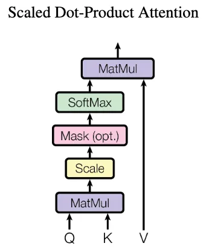

The famous [paper "Attention is all you need" by Vaswani et al.](https://arxiv.org/abs/1706.03762) presents the transformer architecture. 
This neural network architecture builds on the attention mechanism and is at the core of current large language models (LLMs) such as ChatGPT, GPT-4, BERT, etc.

Here are some notes to help understand the transformer neural network architecture and the underlying attention mechanism.

:::{.callout-note}
I also published this blog post on [Medium](https://medium.com/@stefanbschneider/understanding-attention-and-transformers-d84b016cd352) when my blog was down for a while.
:::

# The Transformer Architecture

Transformers process sequences of tokens such as (sub-)words in a sentence. The transformer architecture consists of two parts:

1. The encoder, which processes the tokens of the input sequence and
1. the decoder, which produces new tokens as output based on the input tokens and the previously produced output tokens.

The overall architecture is shown in the figure below with the encoder on the left and the decoder on the right side.

## Encoder

The encoder (left side of the figure above), processes the tokens of the input sequence. Each token is initially embedded into a d- dimensional vector, e.g., using [word2vec](https://www.tensorflow.org/text/tutorials/word2vec). It is then processed individually and compared to other tokens in the input. The process works with variable-length sequences.

After embedding the words as vectors, a **positional encoding** is added, which indicates the absolute and relative position of the tokens in the sequence. This is necessary for many tasks, particularly in natural language, since the later parts of the encoder are permutation invariant. This means they do not distinguish the position of the tokens in the sequence. However, this position may convey important information. For example, in "*The cat watches the dog run fast.*", if the position of "cat" and "dog" were interchanged, it would alter subject and object and thus the meaning of the sentence. In the paper, the authors feed the word position in the sequence into a sine and cosine function and add the resulting value to the input vector.

After positional encoding, follows a **self-attention** block. During self-attention, the tokens *within the input sequence* are compared to each other, computing *attention weights*. A high attention weight for a pair of two tokens indicates that they are syntactically or semantically related. Thus high weights indicate important tokens that the model should "attend" to. In the example sentence "The cat watches the dog run fast.", "run" and "fast" could be two tokens where we would expect high attention weights since they are semantically related. In contrast, "the" and "fast" should lead to low attention weights. More details on attention follow in the sections below.

Finally, a normal feed-forward neural network follows the attention block and outputs the encoded tokens one by one. This encoder block including both attention and the feed-forward network can be repeated multiple times. Finally, the encoded tokens are then fed into the decoder.

Note that both the output of the attention block and the feed-forward block are added to their original inputs and normalized using **residual connections**. These residual connections help back-propagating gradient updates, which might otherwise get lost due to diminishing gradients.

## Decoder

The decoder (right part of the architecture above) is quite similar to the encoder but operates on the output sequence. It takes both the encoded input tokens and the output tokens produced so far as input. Using both, the decoder outputs new tokens, e.g., a translation of the input sequence into another language or a summary of the input text.

Similar to the encoder, the tokens of the output sequence are also embedded into $d$-dimensional vectors and added with a positional encoding regarding the position in the output sequence. As in the encoder, they are then processed using self-attention, comparing the tokens of the output sequence with each other.

In contrast to the encoder, the decoder contains a **cross-attention** block, which compares to the encoded tokens of the input sequence using cross-attention (explained in more detail below). This cross-attention is at the heart of the decoder and helps producing the next output token, taking both the full input and the output produced so far into account.

Similar to the encoder, the decoder also has a normal, fully-connected feed-forward neural network following the attention blocks. The decoder block can also be stacked multiple times. Finally, a linear layer and softmax activation output probabilities for all possible tokens. The token with highest probability is then selected as next token. Producing the output sequence continues until a special end-of-sequence (EOS) token is selected. This allows producing variable-length output sequences independent of the length of the input sequence.

# The Attention Mechanism

The attention mechanism is at the core of the transformer architecture - thus the paper title "Attention is all you need". In a transformer, the attention mechanism enables the model to assign different *attention weights/scores* to different tokens in a sequence. This way, the model can give more importance to relevant information, ignore irrelevant information, and effectively capture long-range dependencies in the data.

The attention mechanism distinguishes three inputs: 

- The query Q,
- the key K,
- the value V. 

Each token in a sequence is a separate input for Q, K, or V. The mechanism compares queries Q with keys K to determine their importance/compatibility to each other, computing attention weights. It then selects corresponding values V with high attention weights. This is an analogy to data bases, hash tables, or Python dictionaries, where we select the values whose keys match a given query best.

## Self-Attention & Cross-Attention

*Self- and cross-attention only differ in which tokens are given as inputs Q, K, and V.* In self-attention, the same tokens are used for all three inputs, i.e., each token is used for Q, K, and V. In cross-attention, the same tokens are given to K and V, but different tokens are used for Q.

Self-attention is applied to the input sequence in the encoder and to the output sequence in the decoder. The decoder's cross-attention module then uses the encoded input tokens as K and V and the produced output tokens as Q.

In either case, attention weights between tokens in Q and in K are calculated using scaled dot-product attention. While there are other forms of attention such as learned attention weights, scaled dot-product attention is faster and more space efficient. In scaled dot-product attention, attention weights are computed without extra parameters as illustrated in the figure below: Tokens in Q and K are multiplied, scaled, and passed through a softmax function to obtain attention weights. The attention weights are then multiplied with the tokens in V to select values with high corresponding weights.

## Example: Computing Attention Weights

Consider two tokens "cat" and "dog", where "cat" is used as query Q and "dog" as key K and value V. Attention is computed as follows:

1. The embedded Q and K tokens are multiplied using the dot product. Let's assume "cat" is embedded as vector $(0.6, 0.3, 0.8)$ and "dog" as vector $(0.5, 0.1, 0.9)$, i.e., we have $d=3$ dimensional embedding vectors. In practice, embedding vectors are much longer (larger $d$) and could be computed using techniques such as word2vec. The dot product of the two vectors here is $0.6*0.5 + 0.3*0.1 + 0.8*0.9 = 1.05$. Note that the product is larger for more similar vectors, which are closer in the embedding space.
1. The result of the multiplication is scaled by dividing by $\sqrt(d)$. In this example: $1.05 / \sqrt(3) = 0.606$. If d is large, the dot product may grow very large. In this case, scaling helps reducing the magnitude and ensuring suitable inputs to the softmax function.
1. Next, the scaled product is fed into a softmax function, which outputs the attention weights. The returned attention weights of all pairs of tokens are between 0 and 1 and sum up to 1. 
In our example, assume we just have two other token pairs with scaled products of $0.2$ and $-0.8$ in addition to the $0.606$. In this case, $softmax([0.606, 0.2, -0.8]) = [0.523, 0.348, 0.128])$, i.e., we have the highest attention weights for our two tokens "cat" and "dog" and smaller weights for the other two pairs.
We can also mask (=ignore) certain positions by setting them to negative infinity, where $softmax(-∞)=0$. This is used in the decoder during training.
1. The computed attention weights are then multiplied with the values V. In our example, "dog" is used as value and its embedding vector $(0.5, 0.1, 0.9)$ is multiplied with attention weight $0.523$, resulting in $(0.262, 0.052, 0.471)$. Other token pairs where Q and K are less compatible may have lower attention weights closer to zero. Consequently, their values V are also reduced to vectors close to zero. The model attends less to these values than to others with high attention scores.

## Multi-Head Attention

Multi-head attention repeats the attention mechanism explained above multiple times ($h$ times) in parallel. Before passing the input tokens of dimension $d$ into these h attention blocks, they projected into smaller embeddings of size $\frac{d}{h}$ by using small linear neural networks. Each of the h linear networks has different weights and leads to different projections. Consequently, each attention "head" can learn to focus on different aspects, e.g., subject and object of a sentence. The outputs of the h heads are then concatenated and passed through another linear neural network.
Multi-head attention is used both in the self-attention blocks as well as the cross-attention block. Note that increasing h allows the network to learn different kinds of attention, e.g., one head for the subject, one for the object, one for the verb of a sentence. h is not directly related to the length of the sequence.

---

Overall, attention is a surprisingly simple yet effective mechanism to emphasize meaningful tokens and ignore less meaningful tokens. Based on this mechanism, transformers can take capture the context even in long sequences and produce coherent outputs.

# Helpful Pointers

- [The original paper "Attention is all you need" by Vaswani et al.](https://arxiv.org/abs/1706.03762)
- [Illustrated guide to transformers on YouTube](https://youtu.be/4Bdc55j80l8?si=vwADvLNcgwJ950OD)
- [Slides "Transformers from scratch" by Umar Jamil](https://github.com/hkproj/transformer-from-scratch-notes/blob/main/Diagrams_V2.pdf)
